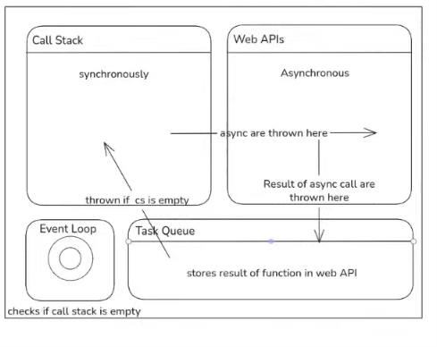

# JavaScript Notes

## Variable Declarations

In `var` and `let` declarations, the initializer is optional. If a variable is declared without an initializer, it is assigned the value `undefined`.

## Variable Scope

A variable may belong to one of the following scopes:

- **Global scope**: The default scope for all code running in script mode.
- **Module scope**: The scope for code running in module mode.
- **Function scope**: The scope created with a function.

In addition, variables declared with `let` or `const` can belong to an additional scope:

- **Block scope**: The scope created with a pair of curly braces (a block).

## Variable / Function Hoisting

- First of all, all functions and variables in the script are hoisted. If a variable is declared with `let` or `const`, it is hoisted to the top of the script with a **temporal dead zone** value. If a variable is declared with `var`, it is hoisted to the top of the script with an initial value of `undefined`. Functions, however, can be accessed before their definition, since the entire function definition is hoisted to the top of the script.
- If we declare an unnamed function or an arrow function and assign it to a variable, trying to call it before the declaration won't work. During hoisting, the compiler only sees the LHS (the variable), not the RHS (the function), so it doesn't know a function exists there. The variable is hoisted, not the function — this results in `undefined` or a temporal dead zone error, depending on the keyword used.
- We can also declare a variable without any keyword (an implicit global), but this should be avoided. Unlike `var`, these are **not hoisted at all** — the property is only created on the global object when that line actually executes. Referencing it earlier throws a `ReferenceError`, not `undefined`.

## Object Property Access

```js
let obj = { name: "Rounak", "age": 18 };
```

- Quoting a key in an object literal (`"age": 18`) doesn't change anything — it becomes the exact same string key as an unquoted one. So both `obj.name` and `obj.age` are valid dot-notation access here; there's no restriction to work around.
- Numeric property names are also allowed, e.g. `{13: "Thirteen"}` is valid (the number is coerced to the string key `"13"`).
- Bracket notation (`obj["age"]`) is still needed when the key is dynamic (stored in a variable) or isn't a valid identifier (e.g. contains spaces or starts with a digit, like `"1st place"`).

## String Formatting

```js
`${name} age is ${age}`
```

## IIFE (Immediately Invoked Function Expression)

```js
(() => {
  console.log("invoked from iife");
})();
```

## Callbacks

Callbacks are functions passed as arguments to other functions. Used extensively in Vue and JS when building websites, e.g. `setTimeout(callback, 1000)`.

```js
function greet(name) {
  return "hello " + name;
}

function run_callback(callback) {
  callback("Rounak");
}

run_callback(greet);
```

## Array Methods

- `map()`, `filter()`, `find()` syntax: `arr.map((x) => {})` — same pattern for all three.
- `reduce()` syntax: `arr.reduce((init, x) => init + x, 2);`
  - Careful with brace syntax: `(init, x) => { init + x }` does **not** work as expected — using `{}` as the arrow function body requires an explicit `return`, otherwise the callback returns `undefined` on every iteration. Either drop the braces (`=> init + x`) or write `=> { return init + x; }`.

All four methods return a value and do **not** modify the original array.

### Sorting

```js
arr.sort(); // default sort
arr.sort((a, b) => a - b); // ascending, for numbers
arr.sort((a, b) => b - a); // descending
```

## `this` Context in Objects

```js
let obj = {
  a: "apple",
  b: function () {
    console.log(this.a);
  }
};
```

This works correctly. However, if an arrow function were used instead of a regular (unnamed) function, it would **not** work and would result in `undefined` when calling `obj.b()`, because arrow functions don't have their own `this` binding — they inherit `this` from the enclosing scope.

### Full Object Example

```js
let obj = {
  var1: "Rounak",
  age: 19,
  func: function () {
    console.log(`${this.var1} age is ${this.age}`);
  },
  func2: function (arg) {
    console.log(arg);
  },
  func2: () => {
    console.log(`${this.name} age is ${this.age}`);
  }
};

obj.func(); // output: "Rounak age is 19" -- context is maintained

let func_new = obj.func;
func_new(); // output: "undefined age is undefined"
// This happens because a copy of the function definition is stored in func_new,
// and it can no longer refer to `this` as the original object's context.
// This is known as "loss of context."
```

### Fixing Loss of Context: `call()`, `apply()`, `bind()`

To restore context, we use three object methods: `call()`, `apply()`, and `bind()` — but they behave differently, and it's important not to treat them as interchangeable:

- **`call()`** and **`apply()`** invoke the function **immediately** and return whatever the function returns (not a new function).
- **`bind()`** does **not** invoke the function — it returns a new function with `this` permanently bound, which you then call separately (hence the extra `()` at the end).

```js
let result1 = obj.func.apply(<context_obj>);   // calls obj.func right away, result1 = return value
let result2 = obj.func.call(<context_obj>);    // calls obj.func right away, result2 = return value
let func_new = obj.func.bind(<context_obj>);   // does NOT call obj.func — returns a bound function
func_new();                                     // this actually calls it
```

**With arguments** — `apply()` takes arguments as an array, while `call()` and `bind()` take them individually:

```js
obj.func.apply(<context_obj>, ["argument1", "argument2"]);       // runs immediately
obj.func.call(<context_obj>, "argument1", "argument2");          // runs immediately
let func_new = obj.func.bind(<context_obj>, "argument1", "argument2");
func_new(); // runs now
```

### Arrow Functions and `this`

For arrow functions, the behavior is completely different. If we access `this.something` inside an arrow function, it does **not** refer to the current object. Instead, it accesses the **global `this`** and searches for the variable there — this may return `undefined` even if the property exists in the current object.

However, at the top level of a classic (non-module, non-strict-mode) script, a variable declared with `var` becomes a property of the global object (e.g. `window` in browsers), so it can be accessed via `this.varName` there. This does **not** hold in general — it doesn't apply inside functions, in ES modules, or in strict mode. `let` and `const` never attach to the global object regardless of scope, so `this.varName` won't find them even at the top level.

## Collections (Lists and Dictionaries)

- We can iterate using `in` or `of` for lists, but only `in` for dictionaries.
- Other helper methods include: `Object.keys(arr)`, `Object.values(arr)`, `Object.entries(arr)`.

## Destructuring

Unpacking values from arrays and objects.

```js
let [a, b] = [1, 2, 3]; // a = 1, b = 2
let [a, , b] = [1, 2, 3]; // a = 1, b = 3 (skips index 1)
let [a, ...b] = [1, 2, 3]; // a = 1, b = [2, 3]
```

If the spread operator is used on the RHS, the list is "dissolved" and no nested array structure persists.

```js
let arr = [1, 2, 3];
let new_arr = [...arr, 4, 5, 6]; // output: [1, 2, 3, 4, 5, 6]
```

### Object Destructuring

```js
let obj = {
  prop1: val1,
  prop2: val2,
};

let { prop1, prop2 } = obj;
// Note: variable names on the LHS must match the object's property names.

// To rename while destructuring:
let { prop1: var1, prop2: var2 } = obj;
```

### Object Spread

```js
const obj2 = {
  ...obj,
  prop3: val3,
};

// Result:
// {
//   prop1: val1,
//   prop2: val2,
//   prop3: val3
// }
```

## Asynchrony


For synchronous codes, they go to the call stack and execute in order. If during execution, an asynchronous function is called, it is sent to the web APIs and the rest of the synchronous code continues to execute. Once the asynchronous function is completed, it is sent to the callback queue. The event loop checks if the call stack is empty and if so, it pushes the returned value of the asynchronous function from the callback queue to the call stack for execution. The task queue codes will get chance to execute only after the call stack is empty. The event loop keeps checking if the call stack is empty and pushes the callback queue codes to the call stack for execution.

# Synchronous vs Asynchronous Behavior in JS

## Synchronous Behavior

Code runs top to bottom, one line at a time — each function call blocks until it finishes before the next line runs.

```js
function first() {
  console.log("First function start");
  second();
  console.log("First function end");
}

function second() {
  console.log("Second function");
}

console.log("Program start");
first();
console.log("Program end");
```

**Output order:**
```
Program start
First function start
Second function
First function end
Program end
```

`first()` doesn't return control back to the main program until it's fully done — including the call to `second()` inside it.

## Asynchronous Behavior

```js
console.log("Start");

setTimeout(function timeoutCallback() {
  console.log("Timeout executed");
}, 2000);

console.log("End");
```

**Output order:**
```
Start
End
Timeout executed
```

`setTimeout` doesn't block execution. It hands the callback off to be run later (after the delay), and the rest of the synchronous code (`console.log("End")`) keeps running immediately. The callback only executes once the call stack is clear and the timer has expired — this is the event loop at work.

### Different Ways to Write the Callback

All of these are equivalent ways to pass a callback into `setTimeout`:

```js
// Named function declaration, defined separately
function timeoutCallback() {
  console.log("Timeout executed");
}
setTimeout(timeoutCallback, 2000);

// Function expression assigned to a const
const timeoutCallback = function () {
  console.log("Timeout executed");
};
setTimeout(timeoutCallback, 2000);

// Arrow function assigned to a const
const timeoutCallback = () => {
  console.log("Timeout executed");
};
setTimeout(timeoutCallback, 2000);

// Inline anonymous arrow function (most common in practice)
setTimeout(() => {
  console.log("Timeout executed");
}, 2000);
```

> Conceptually, `setTimeout(func, delay)` behaves like: wait for `delay` milliseconds, then run `func()` — but it does this asynchronously via the event loop instead of blocking the rest of the program.

## Functions That Use `setTimeout` Internally

```js
function greet() {
  console.log("Hello");
}

function delayedGreet() {
  setTimeout(function () {
    console.log("Delayed Hello");
  }, 1000);
}

console.log("Start");
greet();
delayedGreet();
console.log("End");
```

**Output order:**
```
Start
Hello
End
Delayed Hello
```

Even though `delayedGreet()` is called before `console.log("End")` finishes executing, its internal `setTimeout` callback is deferred — so `"End"` logs before `"Delayed Hello"`.

## More on the Runtime (Event Loop Behavior)

```js
function first() {
  console.log("First start");

  setTimeout(function () {
    console.log("First timeout");
  }, 0);

  console.log("First end");
}

function second() {
  console.log("Second function");
}

console.log("Program start");
first();
second();
console.log("Program end");
```

**Output order:**
```
Program start
First start
First end
Second function
Program end
First timeout
```

Even with a delay of `0` ms, the `setTimeout` callback is **not** run immediately. It's pushed to the callback queue and only runs after:
1. All synchronous code in the current call stack finishes (`first()`, `second()`, and the remaining top-level `console.log`s).
2. The call stack is completely empty.

This demonstrates that `setTimeout(fn, 0)` doesn't mean "run now" — it means "run as soon as possible, after the current synchronous execution completes."

## Prototypes
```js
const x = {
  a: 1,
  inc : function() {
    this.a++;
  }
}
```
We have created an object `x` with a property `a` and a method `inc` that increments `a`. Now, we can create another object `y` that inherits from `x` using the prototype chain.

```js
const y = {
  __proto__: x,
  b: 2
};
```
----------------------------------------------------------------------------
> d.length is not defined if d is a object. It is only defined for arrays. If you want to get the number of properties in an object, you can use `Object.keys(d).length`.

## Objects Oriented Programming (OOP)


## Introduction

Object-Oriented Programming (OOP) is a programming paradigm where code
is organized using objects.\
Objects contain:

-   Properties → Data
-   Methods → Behavior

Example:

``` js
let student = {
    name: "Adarsh",
    age: 21,
    greet() {
        console.log("Hello, my name is " + this.name);
    }
};

student.greet();
```

------------------------------------------------------------------------

# 1. Classes and Objects

## Class

A class is a blueprint used to create objects.

``` js
class Student {
    constructor(name, age) {
        this.name = name;
        this.age = age;
    }

    greet() {
        console.log("Hello, my name is " + this.name);
    }
}
```

## Object

An object is an instance of a class.

``` js
let s1 = new Student("Adarsh", 21);
s1.greet();
```

------------------------------------------------------------------------

# 2. Constructor

Constructor is a special method used to initialize object properties.

``` js
class Car {
    constructor(brand, year) {
        this.brand = brand;
        this.year = year;
    }
}

let car1 = new Car("Toyota", 2022);
console.log(car1.brand);
```

------------------------------------------------------------------------

# 3. Class Methods

Methods are functions defined inside the class.

``` js
class Calculator {

    add(a, b) {
        return a + b;
    }

    multiply(a, b) {
        return a * b;
    }
}

let calc = new Calculator();
console.log(calc.add(2,3));
```

------------------------------------------------------------------------

# 4. Getter and Setter

Used to control access to properties.

``` js
class Student {

    constructor(name) {
        this._name = name;
    }

    get name() {
        return this._name;
    }

    set name(value) {
        this._name = value;
    }
}

let s = new Student("Adarsh");
console.log(s.name);

s.name = "Rahul";
console.log(s.name);
```

------------------------------------------------------------------------

# 5. Static Methods

Static methods belong to the class, not the object.

``` js
class MathUtils {

    static add(a, b) {
        return a + b;
    }
}

console.log(MathUtils.add(5,3));
```

------------------------------------------------------------------------

# 6. Inheritance

Inheritance allows one class to use another class properties and
methods.

``` js
class Animal {

    constructor(name) {
        this.name = name;
    }

    speak() {
        console.log(this.name + " makes sound");
    }
}

class Dog extends Animal {

}

let d = new Dog("Tommy");
d.speak();
```

------------------------------------------------------------------------

# 7. Super Keyword

Used to call parent constructor.

``` js
class Animal {

    constructor(name) {
        this.name = name;
    }
}

class Dog extends Animal {

    constructor(name, breed) {
        super(name);
        this.breed = breed;
    }
}

let d = new Dog("Tommy", "Labrador");
console.log(d.name);
```

------------------------------------------------------------------------

# 8. Complete Example

``` js
class Person {

    constructor(name) {
        this._name = name;
    }

    get name() {
        return this._name;
    }

    set name(value) {
        this._name = value;
    }

    greet() {
        console.log("Hello " + this._name);
    }

    static info() {
        console.log("Person class");
    }
}

class Student extends Person {

    constructor(name, marks) {
        super(name);
        this.marks = marks;
    }

    greet() {
        super.greet();
        console.log("Marks: " + this.marks);
    }
}

let s1 = new Student("Adarsh", 95);
s1.greet();
Person.info();
```

------------------------------------------------------------------------

# Summary

  Concept       Description
  ------------- -----------------------
  Class         Blueprint
  Object        Instance
  Constructor   Initializes object
  Method        Function inside class
  Getter        Get value
  Setter        Set value
  Static        Belongs to class
  Inheritance   Extending class
  Super         Access parent
